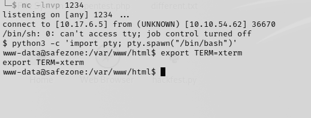

After getting the shell lets convert it into a stable tty shell by using following commands:

```py
python3 -c 'import pty; pty.spawn("/bin/bash")'
export TERM=xterm
```


I searched for the user flag but there were only previous hints that we got. But then we got the password hash for the user files and after cracking it using john we came to know that its password is `magic`


So now we can login as files through ssh!
After finding a bit i used following command to check if there is possibility for port forwading and YES there were two ports running locally...
```py
ss -tulwn
```


I tried 3336 port but there was nothing but port 8000 gave us positive response!


So we ran gobuster on it and found a index.html directory which was a login page.


And its source contained a login.js directory which gave us the creadentials.
So we succesfully loged in....


